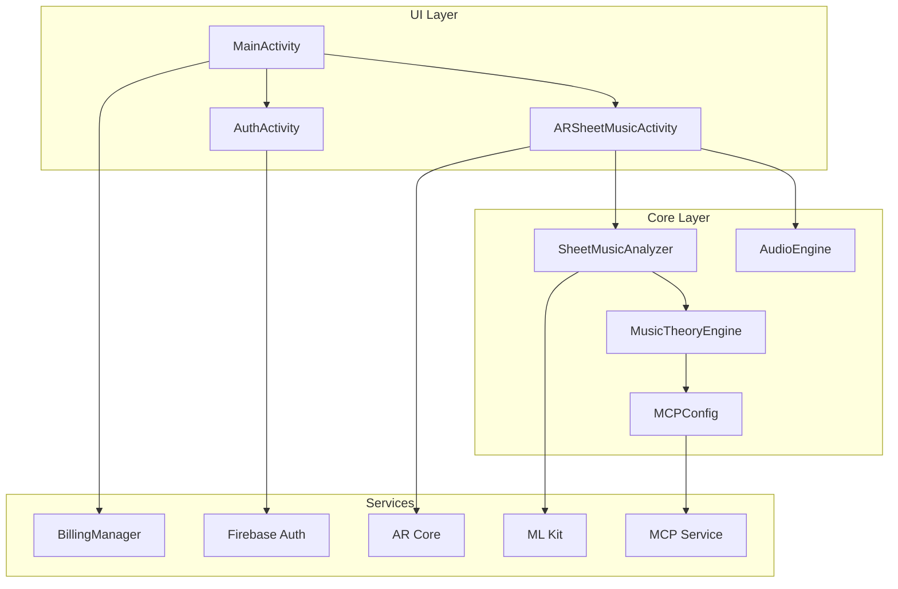
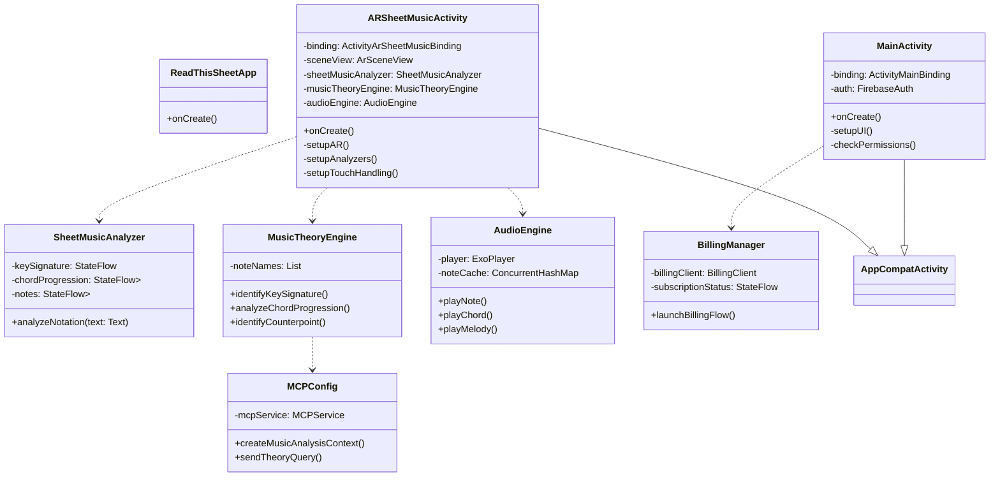
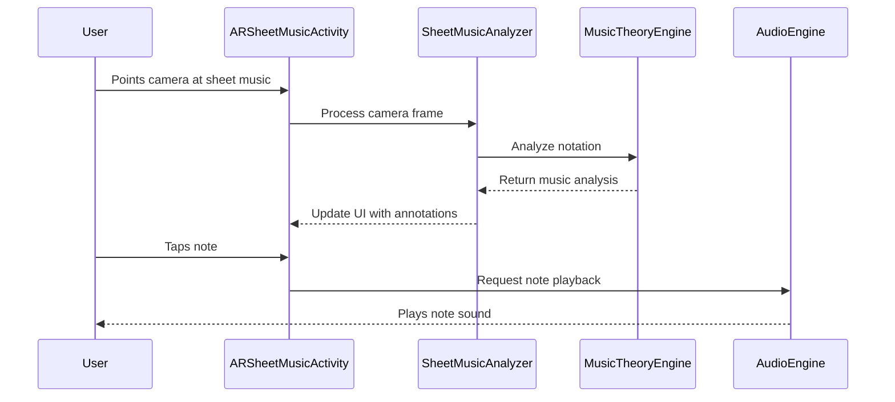
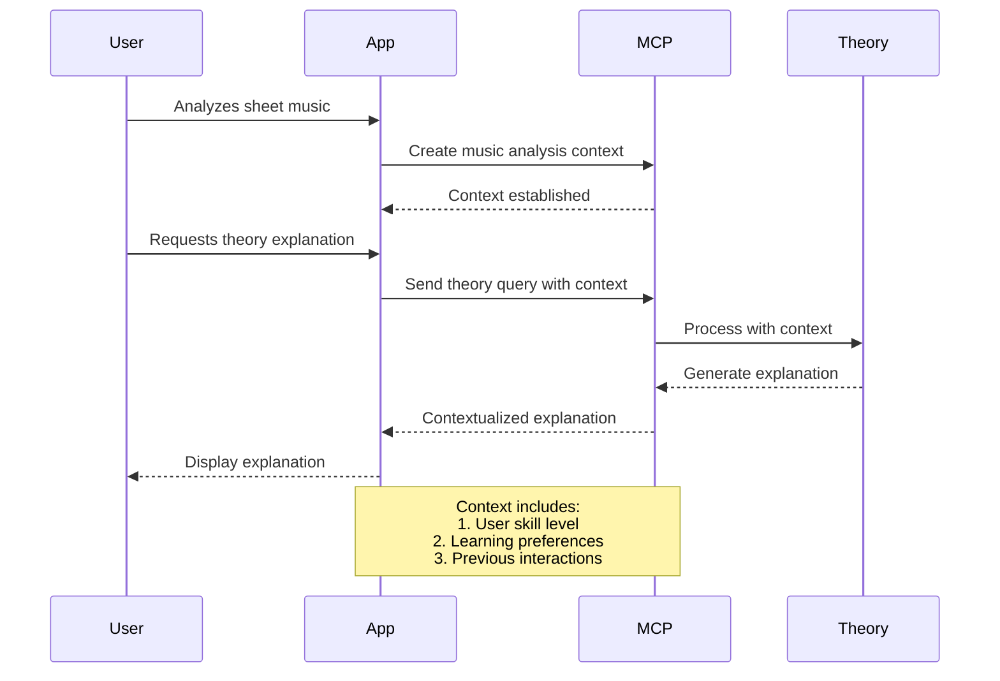
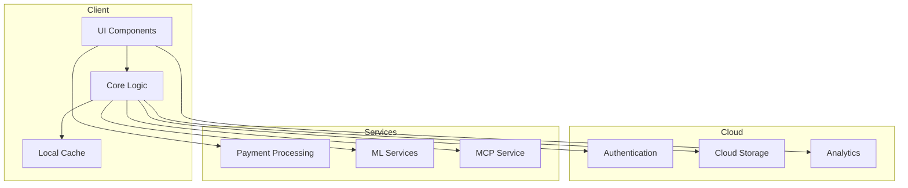

# ReadThisSheet! Architecture Documentation

## System Overview

```mermaid
graph TB
    subgraph UI Layer
        MA[MainActivity]
        AR[ARSheetMusicActivity]
        Auth[AuthActivity]
    end
    
    subgraph Core Layer
        SMA[SheetMusicAnalyzer]
        MTE[MusicTheoryEngine]
        AE[AudioEngine]
        MCP[MCPConfig]
    end
    
    subgraph Services
        BM[BillingManager]
        FB[Firebase Auth]
        AR_CORE[AR Core]
        ML[ML Kit]
        MCP_SERVICE[MCP Service]
    end
    
    MA --> AR
    MA --> Auth
    AR --> SMA
    AR --> AR_CORE
    SMA --> ML
    SMA --> MTE
    MTE --> MCP
    MCP --> MCP_SERVICE
    AR --> AE
    Auth --> FB
    MA --> BM
```

## Class Diagram

```mermaid
classDiagram
    class ReadThisSheetApp {
        +onCreate()
    }
    
    class MainActivity {
        -binding: ActivityMainBinding
        -auth: FirebaseAuth
        +onCreate()
        -setupUI()
        -checkPermissions()
    }
    
    class ARSheetMusicActivity {
        -binding: ActivityArSheetMusicBinding
        -sceneView: ArSceneView
        -sheetMusicAnalyzer: SheetMusicAnalyzer
        -musicTheoryEngine: MusicTheoryEngine
        -audioEngine: AudioEngine
        +onCreate()
        -setupAR()
        -setupAnalyzers()
        -setupTouchHandling()
    }
    
    class SheetMusicAnalyzer {
        -keySignature: StateFlow<String>
        -chordProgression: StateFlow<List<String>>
        -notes: StateFlow<List<Note>>
        +analyzeNotation(text: Text)
    }
    
    class MusicTheoryEngine {
        -noteNames: List<String>
        +identifyKeySignature()
        +analyzeChordProgression()
        +identifyCounterpoint()
    }
    
    class AudioEngine {
        -player: ExoPlayer
        -noteCache: ConcurrentHashMap
        +playNote()
        +playChord()
        +playMelody()
    }
    
    class BillingManager {
        -billingClient: BillingClient
        -subscriptionStatus: StateFlow
        +launchBillingFlow()
    }
    
    class MCPConfig {
        -mcpService: MCPService
        +createMusicAnalysisContext()
        +sendTheoryQuery()
    }
    
    MainActivity --|> AppCompatActivity
    ARSheetMusicActivity --|> AppCompatActivity
    MainActivity ..> BillingManager
    ARSheetMusicActivity ..> SheetMusicAnalyzer
    ARSheetMusicActivity ..> MusicTheoryEngine
    ARSheetMusicActivity ..> AudioEngine
    MusicTheoryEngine ..> MCPConfig
```

## Sequence Diagram (Note Recognition Flow)

```mermaid
sequenceDiagram
    participant User
    participant AR as ARSheetMusicActivity
    participant SMA as SheetMusicAnalyzer
    participant MTE as MusicTheoryEngine
    participant AE as AudioEngine
    
    User->>AR: Points camera at sheet music
    AR->>SMA: Process camera frame
    SMA->>MTE: Analyze notation
    MTE-->>SMA: Return music analysis
    SMA-->>AR: Update UI with annotations
    
    User->>AR: Taps note
    AR->>AE: Request note playback
    AE-->>User: Plays note sound
```

## MCP Integration

```mermaid
sequenceDiagram
    participant User
    participant App
    participant MCP
    participant Theory
    
    User->>App: Analyzes sheet music
    App->>MCP: Create music analysis context
    MCP-->>App: Context established
    
    User->>App: Requests theory explanation
    App->>MCP: Send theory query with context
    MCP->>Theory: Process with context
    Theory-->>MCP: Generate explanation
    MCP-->>App: Contextualized explanation
    App-->>User: Display explanation
    
    Note over App,MCP: Context includes:<br/>1. User skill level<br/>2. Learning preferences<br/>3. Previous interactions
```

## Component Architecture

```mermaid
graph TB
    subgraph Client
        UI[UI Components]
        Core[Core Logic]
        Cache[Local Cache]
    end
    
    subgraph Cloud
        Auth[Authentication]
        Storage[Cloud Storage]
        Analytics[Analytics]
    end
    
    subgraph Services
        Payment[Payment Processing]
        ML[ML Services]
        MCP[MCP Service]
    end
    
    UI --> Core
    Core --> Cache
    Core --> Auth
    Core --> Storage
    UI --> Analytics
    UI --> Payment
    Core --> ML
    Core --> MCP
```
