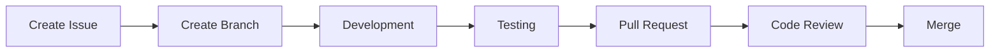
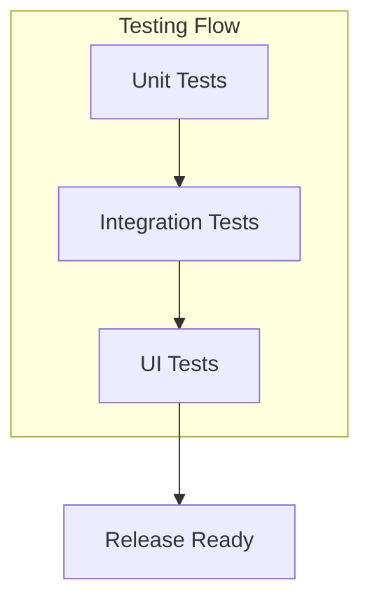
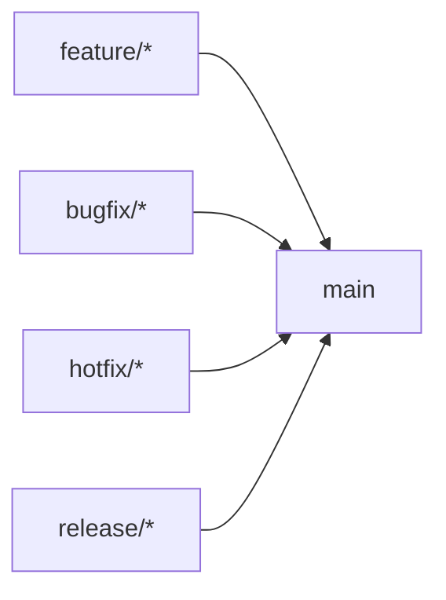
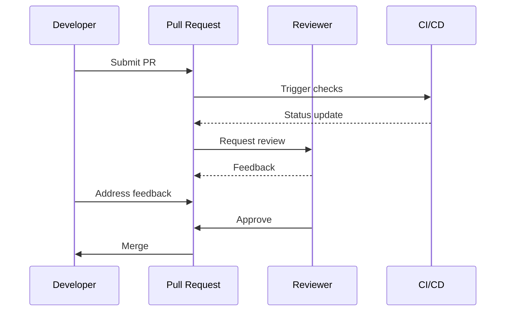

# Contributing to ReadThisSheet!

First off, thanks for taking the time to contribute! 🎵

## Development Process



## Getting Started

1. Fork the repository
2. Create your feature branch (`git checkout -b feature/AmazingFeature`)
3. Commit your changes (`git commit -m 'Add some AmazingFeature'`)
4. Push to the branch (`git push origin feature/AmazingFeature`)
5. Open a Pull Request

## Coding Standards

### Kotlin Style Guide
- Follow the official [Kotlin coding conventions](https://kotlinlang.org/docs/coding-conventions.html)
- Use meaningful variable and function names
- Add KDoc comments for public functions and classes

### Android Best Practices
- Follow Material Design guidelines
- Use ViewBinding for view interactions
- Implement proper lifecycle management
- Handle configuration changes appropriately

## Testing



### Required Tests
- Unit tests for business logic
- Integration tests for component interaction
- UI tests for critical user flows

## Pull Request Process

1. Update documentation
2. Add/update tests
3. Update the CHANGELOG.md
4. Get approval from at least one maintainer
5. Ensure CI passes

## Commit Message Format

```
type(scope): subject

body

footer
```

Types:
- feat: New feature
- fix: Bug fix
- docs: Documentation
- style: Formatting
- refactor: Code restructuring
- test: Adding tests
- chore: Maintenance

## Branch Naming Convention



- feature/* - New features
- bugfix/* - Bug fixes
- hotfix/* - Critical fixes
- release/* - Release preparation

## Code Review Process



## Questions?

Feel free to reach out to the maintainers or open an issue for discussion!
