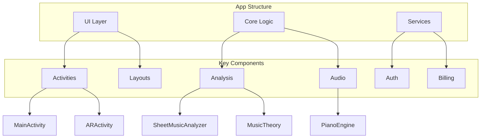

# ReadThisSheet!

Can't read sheet music? No problem! ReadThisSheet! is your witty companion in the world of musical notation. Point your phone at any sheet music and watch as the app magically decodes those mysterious dots and lines into something that actually makes sense!

## Quick Links
- [Architecture Documentation](ARCHITECTURE.md)
- [Development Roadmap](ROADMAP.md)
- [Contributing Guidelines](CONTRIBUTING.md)

## What's This Note Again?

Ever looked at sheet music and thought "What in the world am I looking at?" We've got you covered! ReadThisSheet! uses cutting-edge AR technology to:

- 🎵 Instantly identify notes (even those sneaky ones above and below the staff)
- 🔑 Show key signatures in plain English (because who remembers how many sharps are in F# major?)
- 🎹 Play each note when you tap it (yes, it's like having a piano in your pocket!)
- 📝 Display chord progressions and music theory analysis (impress your music teacher!)
- 🎼 Analyze counterpoint (because Bach was showing off and now you can too!)

## Features

- Real-time AR sheet music recognition
- Tap-to-play any note
- Key signature detection for the key-challenged
- Chord progression analysis that even your cat could understand
- Counterpoint analysis for when you're feeling fancy
- Premium features for the truly dedicated music enthusiasts
- User accounts to save your favorite pieces

## Project Structure


## Getting Started

1. Clone the repository
```bash
git clone https://github.com/rebots-online/ReadThisSheet.git
```

2. Add Firebase configuration
- Create a Firebase project
- Add `google-services.json` to the app directory

3. Build and run
```bash
./gradlew assembleDebug
```

## Development Setup

### Prerequisites
- Android Studio Arctic Fox or newer
- JDK 11 or newer
- Android SDK 34
- ARCore supported device

### Building
```bash
# Debug build
./gradlew assembleDebug

# Release build
./gradlew assembleRelease
```

## Contributing

See [CONTRIBUTING.md](CONTRIBUTING.md) for detailed contribution guidelines.

## Premium Features

Upgrade to premium to unlock:
- Advanced music theory analysis (for when you want to get really nerdy)
- Offline mode (for when your internet is as unreliable as your sight-reading)
- Cloud storage (because your phone storage is already full of cat videos)

## Building for Release

1. Update version numbers (we're professionals here)
2. Configure signing keys (the boring but important part)
3. Build for the Play Store (where the magic happens)

## Requirements

- Android 7.0 or newer (because we're modern like that)
- ARCore-compatible device (your phone needs to see the music too!)
- Google Play Services (the usual suspects)
- A sense of humor (required) and some sheet music (optional, but helpful)

## License

Copyright 2025 ReadThisSheet! by RobinsAI.world
All rights reserved (but we're cool about it)
