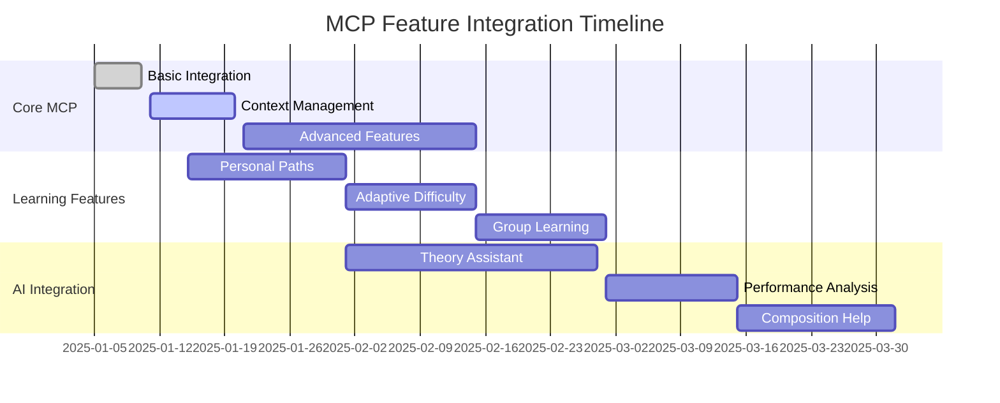
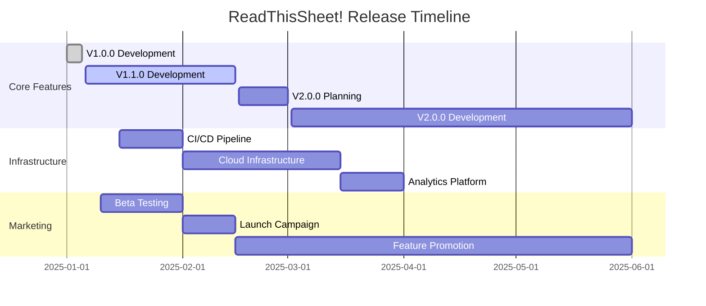

# ReadThisSheet! Development Roadmap

## Current Version (1.0.0)
- [x] Basic AR sheet music recognition
- [x] Note identification and visualization
- [x] Key signature detection
- [x] Basic chord progression analysis
- [x] Piano sound playback
- [x] User authentication
- [x] Basic premium features
- [x] MCP integration for contextual learning

## Short-term Goals (1.1.0)
- [ ] Improved note recognition accuracy
- [ ] Enhanced AR stability
- [ ] Offline mode for premium users
- [ ] Save and organize sheet music
- [ ] Share annotations with other users
- [ ] Custom annotation support
- [ ] Advanced MCP context handling
- [ ] Personalized learning paths via MCP

## Mid-term Goals (2.0.0)
- [ ] Real-time tempo detection
- [ ] Multiple instrument sounds
- [ ] Score following with auto-page turn
- [ ] Integration with popular sheet music libraries
- [ ] Collaborative annotation features
- [ ] AI-powered music theory suggestions
- [ ] MCP-driven adaptive difficulty
- [ ] Context-aware practice recommendations

## Long-term Vision (3.0.0+)
- [ ] Real-time ensemble practice support
- [ ] Virtual music teacher integration
- [ ] Advanced music theory courses
- [ ] Machine learning-based performance feedback
- [ ] VR/AR hybrid experience
- [ ] Integration with smart music stands
- [ ] Multi-user MCP contexts for group learning
- [ ] AI-powered composition assistance

## MCP Integration Milestones

## Technical Debt & Infrastructure
- [ ] Automated testing pipeline
- [ ] Performance optimization
- [ ] Scalable cloud infrastructure
- [ ] Analytics implementation
- [ ] Crash reporting system

## Release Timeline

